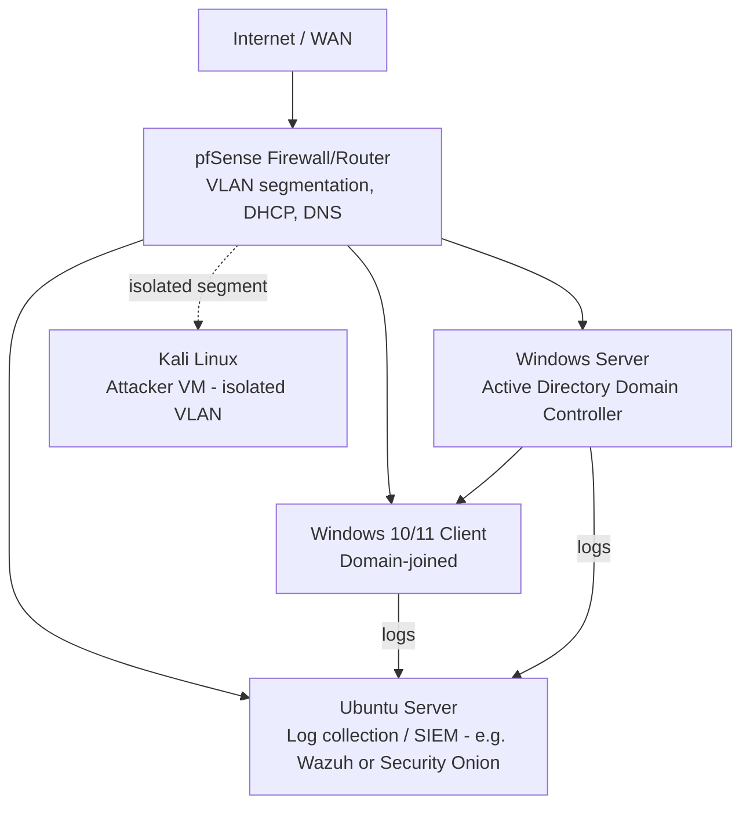

# Home Lab

A virtualized lab for practicing networking, systems administration, and blue-team detection in a safe, isolated environment. This document is the design plan — update it with real screenshots, configs, and notes as each piece gets built.

## Planned architecture

## Why this design

- **pfSense** as the router/firewall gives real experience with VLANs, firewall rules, and DHCP/DNS — core networking skills.
- **Active Directory DC + joined client** covers Windows sysadmin fundamentals: users, groups, GPOs, authentication.
- **Log collection host** (Wazuh or Security Onion) is where blue-team work happens — collecting Windows Event Logs and Linux auth logs to write and test detections.
- **Isolated attacker VM** lets me safely generate real attack traffic (e.g. failed SSH logins, port scans) against my own lab to test detections — never against systems I don't own.

## Build log

| Date | Component | Status | Notes |
|---|---|---|---|
| _TBD_ | Hypervisor setup (VirtualBox/Proxmox) | Not started | |
| _TBD_ | pfSense install + VLANs | Not started | |
| _TBD_ | AD DC install | Not started | |
| _TBD_ | Client domain join | Not started | |
| _TBD_ | Log collector install | Not started | |
| _TBD_ | Kali attacker VM | Not started | |

## Tools

- Hypervisor: VirtualBox (free) or Proxmox VE (if running on dedicated hardware)
- Firewall/router: [pfSense](https://www.pfsense.org/)
- Log collection: [Wazuh](https://wazuh.com/) or [Security Onion](https://securityonionsolutions.com/)
- Attacker OS: [Kali Linux](https://www.kali.org/)

## Safety note

All testing happens inside this isolated lab network only. No scanning, exploitation, or attack traffic is ever directed at systems outside this lab without explicit authorization.
